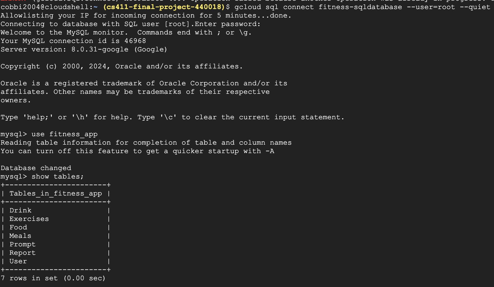
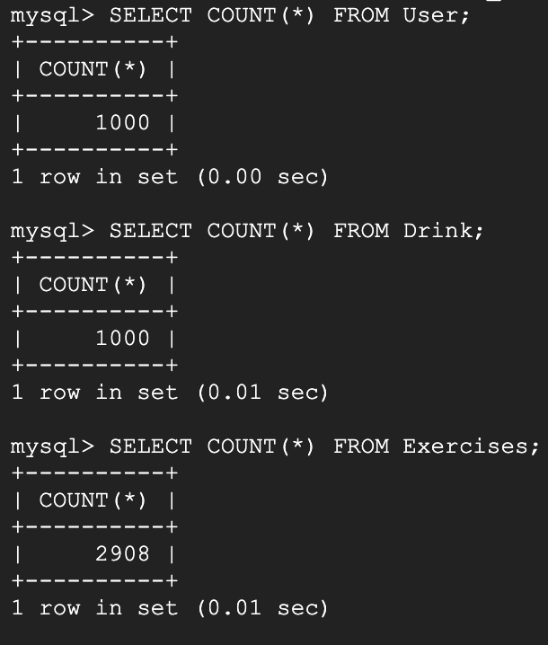

# Queries

## Tables

**Screenshot of connection and tables:**

*DDL Provided in database_design document*
```SQL
use fitness_app;
show tables;
```


---

**Three Tables with at least 1000 items**
```SQL 
SELECT COUNT(*) FROM <TABLE>
```


## Advanced Queries

**Query 1:**

This query uses UNION to combine results from Food and Drink tables, displaying the name and total calories for each unique item.
```SQL
SELECT f.FoodName AS ItemName,
       SUM(f.CaloriesPerGram * f.Quantity) AS TotalCalories
FROM Food f
GROUP BY f.FoodName

UNION

SELECT d.DrinkName AS ItemName,
       SUM(d.CaloriesPerGram * d.Quantity) AS TotalCalories
FROM Drink d
GROUP BY d.DrinkName
ORDER BY TotalCalories DESC
LIMIT 15;
```
*MYSQL Workbench Result:*


**Query 2:**

This query retrieves unique food and drink items that have a higher-than-average caloric value, joining Food and Drink with different selection criteria, then combining them using UNION.

```SQL
SELECT DISTINCT f.FoodName AS ItemName, 
       AVG(f.CaloriesPerGram * f.Quantity) AS AvgCalories
FROM Food f
GROUP BY f.FoodName
HAVING AVG(f.CaloriesPerGram * f.Quantity) > (
    SELECT AVG(CaloriesPerGram * Quantity) 
    FROM Food
)

UNION

SELECT DISTINCT d.DrinkName AS ItemName, 
       AVG(d.CaloriesPerGram * d.Quantity) AS AvgCalories
FROM Drink d
GROUP BY d.DrinkName
HAVING AVG(d.CaloriesPerGram * d.Quantity) > (
    SELECT AVG(CaloriesPerGram * Quantity) 
    FROM Drink
)
ORDER BY AvgCalories DESC
LIMIT 15;
```
*MYSQL Workbench Result:*


**Query 3:**

This query combines data from Food and Drink based on a common NutritionType, allowing us to calculate the total caloric intake per nutritional type using UNION

```SQL
SELECT f.NutritionType, 
       SUM(f.CaloriesPerGram * f.Quantity) AS TotalCalories
FROM Food f
GROUP BY f.NutritionType

UNION

SELECT d.NutritionType, 
       SUM(d.CaloriesPerGram * d.Quantity) AS TotalCalories
FROM Drink d
GROUP BY d.NutritionType
ORDER BY TotalCalories DESC;
```
*MYSQL Workbench Result:* 

**Less than 15 lines**


**Query 4:**

```SQL
SELECT f.NutritionType, 
       AVG(f.CaloriesPerGram * f.Quantity) AS AvgCaloriesPerNutritionalType
FROM Food f
GROUP BY f.NutritionType
HAVING AVG(f.CaloriesPerGram * f.Quantity) > (
    SELECT AVG(f2.CaloriesPerGram * f2.Quantity)
    FROM Food f2
)

UNION

SELECT d.NutritionType, 
       AVG(d.CaloriesPerGram * d.Quantity) AS AvgCaloriesPerNutritionalType
FROM Drink d
GROUP BY d.NutritionType
HAVING AVG(d.CaloriesPerGram * d.Quantity) > (
    SELECT AVG(d2.CaloriesPerGram * d2.Quantity)
    FROM Drink d2
)
ORDER BY AvgCaloriesPerNutritionalType DESC;
```
*MYSQL Workbench Result:* 

**Less than 15 lines**


## Indexing